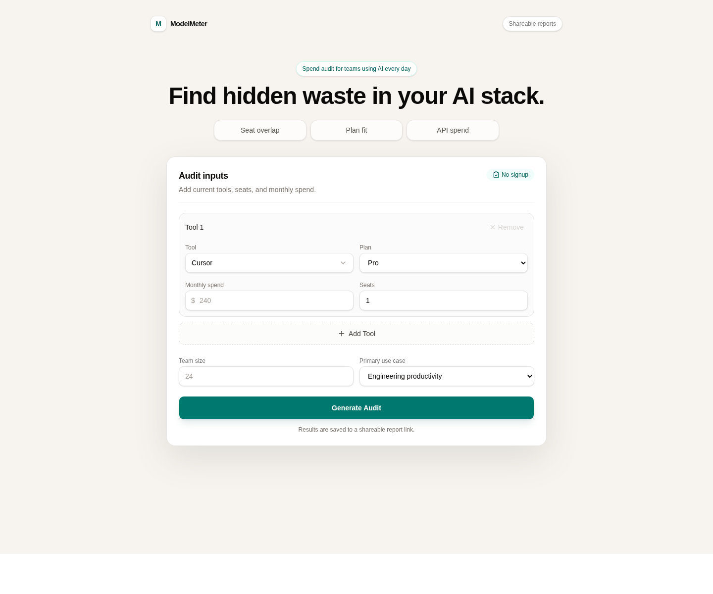
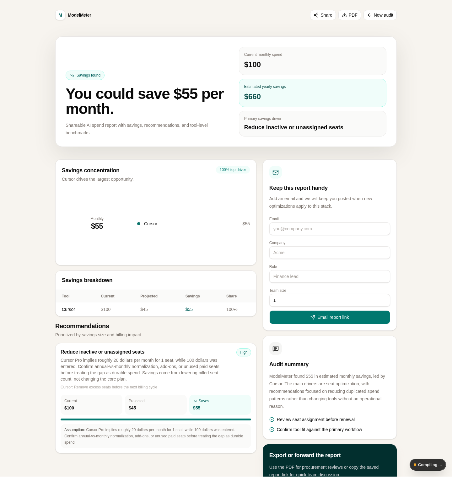
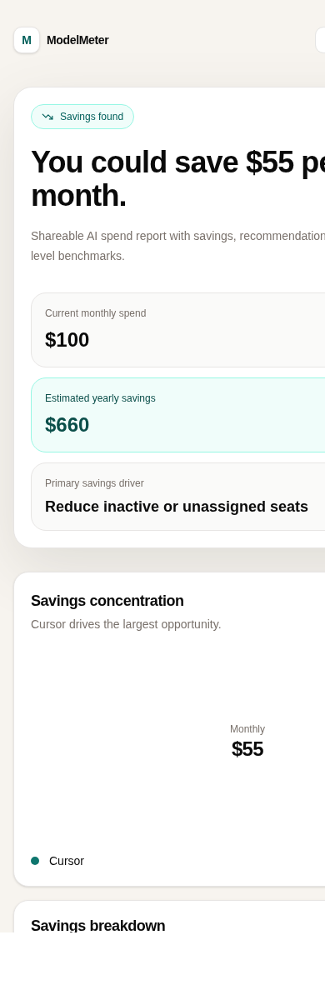

# ModelMeter

ModelMeter is a free AI spend audit tool for startup founders, engineering managers, and finance/ops leads who need a quick second opinion before paying another month of AI tooling bills. It collects current AI tools, plans, seats, monthly spend, team size, and use case, then generates a shareable report with modeled monthly/annual savings and operational recommendations.

The audit math is deterministic and traceable. The LLM is only used for a short personalized summary when `ANTHROPIC_API_KEY` is configured; savings, plan fit, and recommendations come from structured pricing metadata and rules.

## AI Usage Disclosure

This project was built primarily through iterative AI assistance during exam time. I am disclosing that directly rather than presenting the repository as a fully hand-coded-from-scratch build.

My role was product direction, prompt design, review, directing validation, debugging from real errors, and deciding the boundaries of the deterministic audit engine. This was not treated as a one-shot generation; the project went through multiple correction and hardening passes. The detailed disclosure is in `REFLECTION.md` and `PROMPTS.md`, as requested by the assignment.

**Live deployed URL:** add the final Vercel URL here before submitting the Google Form.

## Screenshots

| Audit form | Results dashboard | Mobile report |
| --- | --- | --- |
|  |  |  |

## What It Does

- Collects AI tooling spend without requiring login.
- Supports Cursor, GitHub Copilot, Claude, ChatGPT, Gemini, OpenAI API, Anthropic API, and Windsurf.
- Evaluates plan fit, seat efficiency, overlapping assistants, API spend ownership, enterprise overkill, and annual-vs-monthly input mismatches.
- Saves each audit to Supabase and creates a public `/results/[id]` report.
- Captures email after value is shown, stores the lead, and sends a Resend confirmation email.
- Generates Open Graph/Twitter previews for shared reports.
- Exports a procurement-friendly PDF report.
- Surfaces Credex for audits with more than `$500/month` in modeled savings.

## Tech Stack

- Next.js App Router 16
- React 19
- TypeScript
- Tailwind CSS
- shadcn/ui-style primitives
- Recharts
- Supabase
- Resend
- Anthropic Messages API for the optional summary paragraph
- pdf-lib

## Quick Start

```bash
npm install
npm run dev
```

Open `http://localhost:3000`.

Run checks:

```bash
npm run lint
npm test
npx tsc --noEmit
npm run build
```

## Environment Variables

Create `.env.local`:

```bash
NEXT_PUBLIC_SUPABASE_URL=
NEXT_PUBLIC_SUPABASE_ANON_KEY=
NEXT_PUBLIC_SUPABASE_PUBLISHABLE_KEY=
NEXT_PUBLIC_SITE_URL=http://localhost:3000

ANTHROPIC_API_KEY=
ANTHROPIC_MODEL=claude-3-5-haiku-20241022

RESEND_API_KEY=
RESEND_FROM_EMAIL="ModelMeter <onboarding@resend.dev>"
```

Notes:

- Use either `NEXT_PUBLIC_SUPABASE_ANON_KEY` or `NEXT_PUBLIC_SUPABASE_PUBLISHABLE_KEY`.
- `ANTHROPIC_API_KEY`, `RESEND_API_KEY`, and `RESEND_FROM_EMAIL` are read only by server routes.
- If Anthropic is not configured, the app falls back to a deterministic templated summary.
- The Resend onboarding sender is fine for local testing. Use a verified sender for production.
- Restart the dev server after changing `.env.local`.

## Supabase Setup

Run [supabase/audits.sql](supabase/audits.sql) in the Supabase SQL Editor. It creates:

- `public.audits`
- `public.leads`
- insert/select RLS policies for audit creation and public report reads
- insert RLS policy for public lead capture

If Supabase reports a schema cache issue after creating tables:

```sql
notify pgrst, 'reload schema';
```

## Resend Setup

1. Create a Resend API key.
2. Add `RESEND_API_KEY` and `RESEND_FROM_EMAIL`.
3. Submit the lead form from a saved report.
4. Confirm the UI says the email was sent and the email arrives.

The lead is still stored if email delivery is skipped or fails; the UI tells the user what happened.

## Deploy

Vercel is the intended target.

1. Add all environment variables in Vercel.
2. Run the Supabase SQL in the production Supabase project.
3. Set `NEXT_PUBLIC_SITE_URL` to the deployed origin.
4. Deploy.
5. Smoke test audit creation, result URL, lead capture, email, PDF export, and Open Graph previews.

## Decisions

1. **Deterministic audit engine over LLM-driven math**  
   Financial recommendations need to be inspectable. The LLM can summarize findings, but it cannot choose plans or calculate savings.

2. **Audit first, lead capture second**  
   The assignment explicitly asks for value before email. This also feels better for a free acquisition tool.

3. **Public UUID report URLs instead of accounts**  
   Shareability matters more than account management at this stage. Lead data is stored separately so public reports do not leak identity.

4. **Server-generated PDF instead of screenshot export**  
   `pdf-lib` keeps the report crisp, text-based, and predictable for procurement review.

5. **Selective pricing metadata**  
   Cursor, Claude, ChatGPT, and GitHub Copilot have structured per-seat plan metadata. Usage-based API tools are handled conservatively because token pricing depends on workload mix.

## Known Limitations

- No authenticated workspace or admin lead dashboard.
- No billing import; users enter spend manually.
- Gemini/API recommendations are contextual, not fully plan-rightsized.
- Vendor pricing should be refreshed before commercial use.
- Real user interview notes must be completed by the candidate before submission; see `USER_INTERVIEWS.md`.
